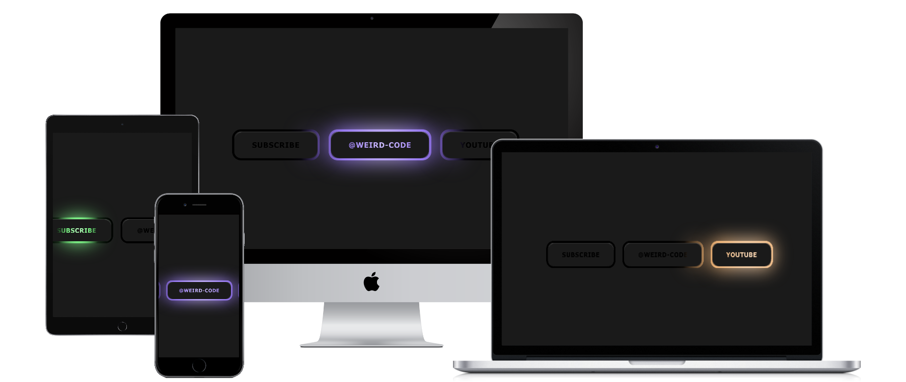

 
# Glow Text Button

## Table of contents

- [Screenshot](#screenshot)
- [Links](#links)
- [Built with](#built-with)
- [Author](#author)

### Screenshot

### Built with

- HTML5
- CSS
- JavaScript

## Author

- LinkedIn - [https://www.linkedin.com/in/sohel-hussain]
- Github - [https://github.com/Sohel-pc]

## Installation

Clone Repository in your system and Enjoy!😄🎉

<!-- 
┌───────────────────┐              ┌──────────────────┐
│                   │              │ In:sohel-hussain │
│  Follow For More  │  ──────────► │                  │
│                   │              │ Git: Soherl-pc   │
└───────────────────┘              └──────────────────┘
-->
